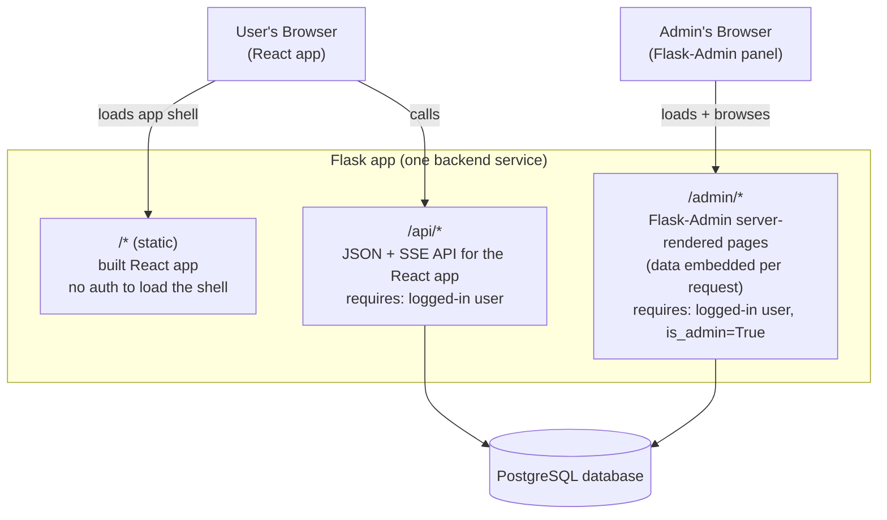

# Rhetor Platform — Design Document (v1)

## Overview

Rhetor becomes a web application that runs the argument-generation pipeline described in [`idea.md`](idea.md) as an interactive, chat-driven tool. A user gives the AI a British Parliamentary motion and position, works through three stages of argument development in conversation with the AI, and exports a final shortlist of arguments. Each user brings their own OpenAI, Anthropic, or Google Gemini API key — Rhetor orchestrates the pipeline, it does not pay for or proxy model usage on the user's behalf.

This document covers the product flow, architecture, data model, and the open questions still to resolve. It assumes `idea.md` as the source of truth for what the AI should actually produce at each stage — this document is about the system built around it.

## v1 Scope

**In scope:**
- Self-serve account signup (no invite gating)
- BYOK support for OpenAI, Anthropic, and Google Gemini, one key per provider per account
- Multiple "motions" per user, switchable like chat threads
- Chat-driven progression through Stage 1 → Stage 2 → Stage 3 of `idea.md`
- A live document panel showing the current stage's output, next to the chat
- Ability to return to an earlier stage and continue the conversation there
- Export of the final Stage 3 shortlist as Markdown, PDF, or copy-to-clipboard
- Admin backend: user list, motion counts, full read access into any motion's content

**Explicitly deferred to a later version:**
- Targeted (block-level) document edits — v1 regenerates the whole stage document each turn
- Direct user editing of the generated document
- ~~User-selectable models within a provider~~ — built; see "Provider & Model Selection"
- Invite codes / approval gating for signup
- Version history / snapshots of earlier stage documents
- Hosting platform selection (see "Deployment" below)

## User-Facing Flow

### Account

Standard email/password signup, no invite code or approval step required. On first login, the user is prompted to add at least one API key (OpenAI, Anthropic, and/or Google Gemini) under account settings before they can create a motion. Keys are stored encrypted and are never shown again after entry — the settings page shows a masked value (e.g. `sk-...a8f2`) with a "replace" action, never a "reveal" action.

### Motions List

The left-hand sidebar (once inside the app) lists the user's motions, similar to a chat list in a typical LLM product. Each entry shows an auto-generated, user-editable title and which stage it's currently on.

### Creating a Motion

Clicking "New Motion" opens a fresh chat. There is no separate creation form — the AI's first message asks the user to state the motion and their position (one of BP's four: OG, OO, CG, CO). Once the user replies with the motion, the same LLM call that produces the first Stage 1 document also returns a short (3-6 word) title, which becomes the sidebar label. The user can rename it at any time, the same way most chat products allow renaming a conversation.

### Working Through a Stage

The screen is split: chat on the left, the current stage's document on the right. Each time the user sends a message:

1. The backend assembles: the stage-scoped system prompt (see "Prompt Construction" below), the full chat history for the *current stage only*, and the current stage's document.
2. One LLM call is made, requesting structured output: `{ "reply": string, "document": string }`.
3. `reply` is appended to the chat panel. `document` fully replaces the stored document for that stage and re-renders the right-hand panel.

The document is read-only in the UI — the user never edits it directly, only through conversation.

### Advancing Stages

An explicit "Move to Stage 2" (and later "Move to Stage 3") button sits above the document panel. The AI never advances stages on its own judgment. Clicking it:

1. Locks the current stage as complete.
2. Makes an LLM call using the now-finalized current-stage document, the stage-scoped system prompt for the *next* stage, and any chat history that already exists for the next stage (empty, unless the user has been here before — see below).
3. Produces the next stage's starting document, and the UI switches to showing that stage.

### Returning to an Earlier Stage

A user can navigate back to any earlier stage and keep discussing it — the AI may think of new angles or the user may want to revise. If they change that stage's document, the *next* stage's document is invalidated (no longer shown as current). Re-advancing regenerates the next stage's document, but crucially, any chat history that already existed for that next stage is *not* deleted — it's included as context in the regeneration call. This means prior refinement discussion for that stage is naturally taken into account even though the document itself starts fresh. There is no branching or version history in v1: regenerating overwrites what was there before.

### Export

From Stage 3, the user can export the current shortlist of arguments — just the document content, with no additional AI-generated summary — in three forms:
- Markdown file download (the stored content served as-is)
- PDF download (Markdown rendered to PDF server-side)
- Copy-to-clipboard (client-side, no backend involvement)

## Architecture

Single unified Flask application, one deployment artifact. The backend has two responsibilities, and nothing more at this level of detail:

1. **Serve the web app(s) to the browser** — the static React build for end users, and Flask-Admin's server-rendered pages for admins.
2. **Provide the API the React app needs** — the JSON/SSE endpoints under `/api/*`. Flask-Admin doesn't call this API itself: it's server-rendered, so its pages come back with their data already embedded in one response.

These two responsibilities are split into three route namespaces, each with its own auth requirement — `/api` and `/admin` are kept separate specifically because they authorize differently (a regular logged-in user vs. a logged-in user with `is_admin=True`), even though both live in the same Flask process:



- **Backend:** Flask, one service, no separate service boundary between the user-facing API and the admin panel — just different routes in the same process. Streaming chat replies use Server-Sent Events, at `/api/motions/<id>/messages/stream` and `/advance/stream`. Structured output does not prevent this: the provider streams the JSON object, and the server walks it as it arrives, emitting the decoded contents of `reply` and then `document` as `delta` frames, followed by one `done` frame carrying the saved motion. Field order in the schema is what makes the chat answer land before the document starts. Searching stages cannot stream — Gemini runs research as a separate ungrounded pass and Anthropic cannot force its submit tool while search is available — so those turns return `409 no_streaming` and the client falls back to the buffered endpoint, which remains available for every turn.
- **Frontend:** React, built separately (Vite or similar) and served by Flask as static files — one deploy, no separate frontend host.
- **Admin:** Flask-Admin, mounted in the same app, generating its panel directly from the SQLAlchemy models — no separate hand-built admin UI codebase, aside from one custom template for the motion-detail view (chat transcript + rendered documents). Restricted to accounts with an `is_admin` flag.
- **Database:** PostgreSQL (via SQLAlchemy), the single source of truth both the API and the admin panel read from.
- **LLM calls:** Made server-side from Flask, using the requesting user's decrypted API key for the provider selected on that motion.

## Data Model

**User**
- id, email, password_hash
- encrypted_openai_key (nullable)
- encrypted_anthropic_key (nullable)
- encrypted_gemini_key (nullable)
- openai_key_masked, anthropic_key_masked, gemini_key_masked (nullable — the display form, stored so the settings page never decrypts just to render)
- is_admin (bool)
- created_at

**Motion**
- id, user_id (FK)
- title (auto-generated, user-editable)
- motion_text, position (OG/OO/CG/CO)
- provider (openai | anthropic | gemini) — fixed once the motion is created
- model (nullable — the chosen model id; null falls back to the provider's default, so a retired id doesn't strand the motion)
- current_stage (1, 2, or 3)
- stage_1_document, stage_2_document, stage_3_document (nullable text — Markdown; null until that stage has been reached/regenerated)
- created_at, updated_at

**ChatMessage**
- id, motion_id (FK), stage (1, 2, or 3 — which stage's conversation this belongs to)
- role (user | assistant)
- content
- created_at

No separate tables for individual arguments/seeds/fields — stage documents are stored as single Markdown blobs, per the earlier decision to keep the AI's output format and the storage format identical.

## AI Agent Design

### Decision Engine: no framework

No LangChain or similar orchestration framework — the AI Agent Core calls the OpenAI, Anthropic, and Google Gemini SDKs directly, behind one thin adapter function: `generate(provider, model, system_prompt, history, schema) -> {reply, document}`. This stays small because the provider's hosted web search tool needs almost no orchestration code on our side (the provider executes the search itself; our code just enables the tool and handles the rare `pause_turn` resend), and there's no cyclic reasoning or multi-agent coordination for a framework to manage. Conversation history is never held in a framework's memory abstraction — it's read from and written to the `ChatMessage` table directly (see Data Model), converted into each provider's message format immediately before the call.

### Prompt Construction

`idea.md` is split into stage-scoped prompt files rather than sent in full on every call:
- A **shared** section: the Ordinary Intelligent Voter standard and the Argument Format rules, included in every stage's system prompt.
- A **Stage 1**, **Stage 2**, and **Stage 3** section, each included only when that stage is active.

This is a one-time editorial split of the existing document (already organized under clear stage headers) and meaningfully reduces the tokens sent per turn compared to including the entire ~70KB document every time.

### Structured Output Contract

Every chat-turn call requests structured output:
```json
{ "reply": "string — shown in the chat panel",
  "document": "string — full Markdown, replaces the stage document" }
```
All three providers support enforced structured/JSON output, so this is a schema passed to the API, not a parsing hack — though each expresses it differently: OpenAI uses the Responses API's strict `json_schema`, Anthropic a single `submit_turn` tool whose input schema *is* the contract, and Gemini `response_json_schema` (which additionally rejects `additionalProperties`, so it is stripped).

### Web Search

Stage 2's Evidence field needs real-world facts, precedents, and examples — for that, the AI Agent Core enables each provider's **native, hosted web search tool** (all three providers offer one) on the API call, rather than building or integrating a separate search service. The provider runs the search server-side and returns results directly in the same response; there's no search API for Rhetor to call, no search provider account to manage, and no third credential to collect from users.

**Gemini is the exception to the single-call shape.** Its JSON-schema response mode and the Google Search grounding tool are mutually exclusive — one request cannot ask for both. So a searching stage runs two calls on Gemini: one grounded and free-form to research, then one schema-constrained to write the document from those notes, fed back in as the model's own prior turn. Stages without search stay a single call, as on the other two providers.

Billing follows the same BYOK model as everything else: web search is billed per-search plus the usual token cost, charged to whichever API key made the call — the user's own key. Rhetor never pays for search and never sees a separate bill for it.

### Provider & Model Selection

- Provider (OpenAI, Anthropic, or Google Gemini) is chosen per motion, from whichever key(s) the user has configured. A motion's provider is fixed once created.
- **Model is chosen per motion and is user-facing**, from a catalogue defined in `backend/app/llm/catalogue.py`. Each provider offers a frontier tier, a balanced default, and a cheap/fast tier, so the same pipeline can run at whatever cost the user is willing to carry. The model can be switched mid-motion; it affects the next generation only.
- Defaults are deliberately chosen to be reachable on a **free** API key. This reverses the original v1 decision to fix one model per provider and hide the choice: Gemini's Pro models are effectively unusable on a free key, so a user holding one had no working option at all. A default nobody can run is worse than a slightly weaker one everybody can.
- Models flagged `freeTier: false` are labelled as needing a paid key in the picker, rather than being hidden — the user may well have one.

## Security

- API keys are encrypted at rest using symmetric encryption (Python's `cryptography` library, Fernet), with the encryption secret held in a server environment variable — never committed to the repo, never logged.
- Keys are decrypted only in-memory, at the moment of making an API call on the user's behalf.
- Once entered, a key is never shown again in full — only a masked form (e.g. last 4 characters), with a replace action.

## Admin Backend

Built with Flask-Admin against the same models. For v1, admin accounts have full read access to all users' motions, including document content and chat history — reasonable for a small closed beta among people the developer knows, but worth disclosing to users if the audience grows beyond that.

**Users**
- List view of all registered users, with a count of their motions
- Searchable by email and username (`column_searchable_list` on those two fields — native Flask-Admin, no custom code)
- Clicking into a user shows their profile fields plus a list of their motions. Flask-Admin's default detail view only dumps flat fields, so "list of this user's motions" is done by making `user_id` a filterable link on the Motions list view — clicking a user links to the Motions list pre-filtered to that user, rather than embedding the list inside the profile page itself. Simple to build, no custom template needed.

**Motions**
- List view of all motions across all users, searchable by title and motion text (`column_searchable_list` again — native)
- Clicking into a motion opens a **custom detail view** (not Flask-Admin's default field dump) that renders the full chat transcript (role-tagged, in order) and the generated document(s) for each stage, with the Markdown rendered readably rather than shown as raw text. This is the one piece of admin functionality that isn't "free" from Flask-Admin — everything else above is standard `ModelView` configuration, but a good chat/document view needs its own template.

## Deployment (Open)

Not yet decided. Options on the table, to revisit later:
- **Heroku**, funded by GitHub Student Developer Pack credits ($13/month for 24 months) — native GitHub auto-deploy, managed Postgres included, but the Eco Dyno sleeps after 30 minutes idle and the credit is time-limited.
- **Render** free tier — no cost at all, git-based auto-deploy, but the free web service also sleeps after 15 minutes idle, and the free Postgres tier expires after 90 days.
- **DigitalOcean Droplet**, funded by the Student Pack's $200 credit — a real VPS, no cold starts, full control, but requires self-managing Nginx/systemd/HTTPS and a hand-written GitHub Actions deploy script (SSH + pull + restart).

Whichever is chosen, the CI/CD requirement (auto-deploy on push to `main`) is satisfied either natively (Heroku, Render) or via a GitHub Actions workflow (DigitalOcean).

## Open Questions for Later Versions

- Should stage documents keep version history so re-advancing after going back doesn't discard prior generations outright?
- Should targeted (block-level) document edits replace full-stage regeneration once the core loop is validated?
- Should signup gain an invite code or approval step if the user base grows past "people I know"?
- Rate limiting / abuse guardrails on the server itself (independent of BYOK cost, to protect uptime) have not been designed yet.
